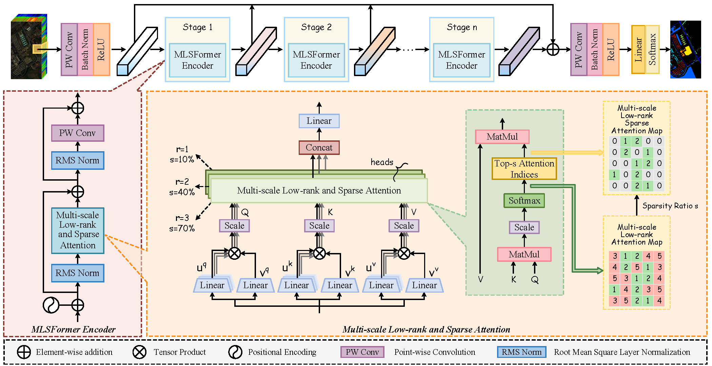

# 📖 Multi-scale Low-rank and Sparse Attention based Transformer for Hyperspectral Image Classification (GRSL 2025)

Demo code of ["Multi-scale Low-rank and Sparse Attention based Transformer for Hyperspectral Image Classification"](https://ieeexplore.ieee.org/document/11134391)

- Authors: Jinliang An, Longlong Dai, Muzi Wang, Weidong Zhang and Xiangrong Zhang

### 🧩 Overall
<div align=center>

</div>

### 🥰 Citation	

**Please kindly cite the papers if this code is useful and helpful for your research.**
```
@ARTICLE{11134391,
  author={An, Jinliang and Dai, Longlong and Wang, Muzi and Zhang, Weidong},
  journal={IEEE Geoscience and Remote Sensing Letters}, 
  title={Multi-scale Low-rank and Sparse Attention based Transformer for Hyperspectral Image Classification}, 
  year={2025},
  volume={},
  number={},
  pages={1-1}
}
```

